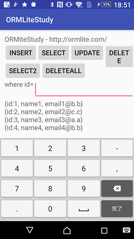

ORMLiteStudy
====
AndroidでORMLiteを使ってみたメモ。

ORMLiteはAndroidで使えるORマッパー。

- ORMLite
  - http://ormlite.com/
  - ライセンスはMIT

要点メモ
----
- Testクラス(Test.java)はマッピングするクラス。
  - アノテーションを使って、テーブルとのマッピングを定義する
- TestDBHelperクラス((TestDBHelper.java)はDBを操作するためのヘルパークラス
  - OrmLiteSqliteOpenHelperクラスを継承して作成する
- 実行手順の詳細はMainActivity.javaを参照

Dao

    public class TestDBHelper extends OrmLiteSqliteOpenHelper  {
         .
         .
         .
        public Dao<Test, Integer> getTestDao() {
        if (simpleDao == null) {
            try {
                simpleDao = getDao(Test.class);
            }
            catch (SQLException e) {
                Log.e(TAG, "getDao() failed...", e);
            }
        }
        return simpleDao;
    }
    
         .
         .
         .
    
    TestDBHelper helper = new TestDBHelper(getBaseContext());
    Dao<Test, Integer> dao = helper.getTestDao();
    

INSERT

    Test ent = new Test("名前", "メールアドレス");
    dao.create(ent);

SELECT

    全件取得
    
        List<Test> results = dao.queryForAll();
    
    1件だけ
    
        Test result = dao.queryBuilder()
                        .where()
                        .eq(Test.COLUMN_ID, 123)
                        .queryForFirst();
    
    条件にマッチするレコードだけ取得
    
         QueryBuilder<Test, Integer> builder = dao.queryBuilder();
         builder.where().like(Test.COLUMN_EMAIL, "LIKEの条件");
         builder.offset(0L).limit(100L); // ページング
         List<Test> results = builder.query();
    
COUNT

    // queryBuilder.setCountOf(true), dao.countOf()を使用する
    QueryBuilder queryBuilder = dao.queryBuilder();
    queryBuilder.setCountOf(true);
    // queryBuilderなので条件はwhere()などで設定可能
    
    long count = dao.countOf(queryBuilder.prepare());

UPDATE

    Test obj = dao.queryBuilder()
            .where()
            .eq(Test.COLUMN_ID, 123)
            .queryForFirst();
    
    obj.setEmail("new-email@example.com");
    
    dao.createOrUpdate(obj);

DELETE

    条件にマッチしたレコードだけ削除
    
        DeleteBuilder<Test, Integer> builder = dao.deleteBuilder();
        builder.where().eq(Test.COLUMN_ID, 1234);
        builder.delete();
    
    全件削除
    
        dao.deleteBuilder().delete();
    

Copyright and license
----
Copyright (c) 2017 yoggy

Released under the [MIT license](LICENSE.txt)
